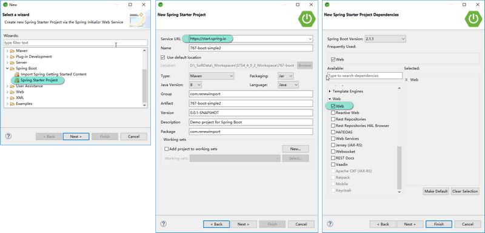

# 2小时学会SpringBoot

2018.11.11 16:21 

> from https://www.imooc.com/article/260567

由于课程内容引起女学员不适，这门课已经被慕课网下架了...

有缓存过视频的同学可以联系一下我

课程源码 <https://gitee.com/liaoshixiong/girl>

目录
----

- 第1章 SpringBoot介绍

	- 1-1 SpringBoot介绍和课程安排  (05:50) 

- 第2章 第一个SpringBoot应用 : 快速构建第一个SpringBoot应用

	- 2-1 第一个SpringBoot应用 (13:52) 

- 第3章 项目属性配置 : 项目属性配置的各种方法

	- 3-1 项目属性配置 (20:09) 

- 第4章 Controller的使用 : 介绍SpringBoot项目中Controller的使用

	- 4-1 Controller的使用 (18:29) 

- 第5章 数据库操作 : SpringBoot中使用spring-data-jpa

	- 5-1 数据库操作（上） (12:33) 

	- 5-2 数据库操作（下） (21:16) 

- 第6章 事务管理 : 演示了SpringBoot中使用事务的简单例子

	- 6-1 事务管理 (08:19) 

- 第7章 课程回顾 : 回顾课程内容

	- 7-1 课程回顾 (03:39) 
	

